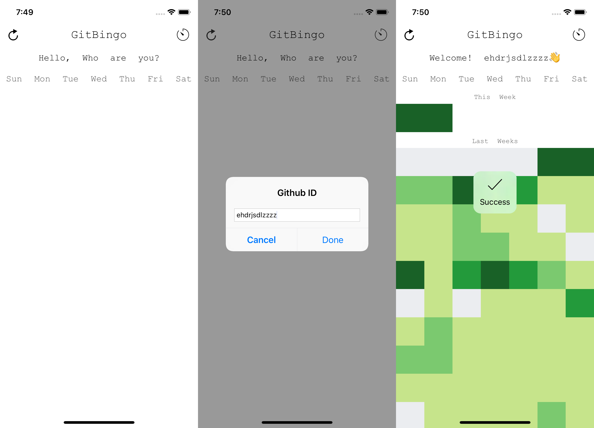
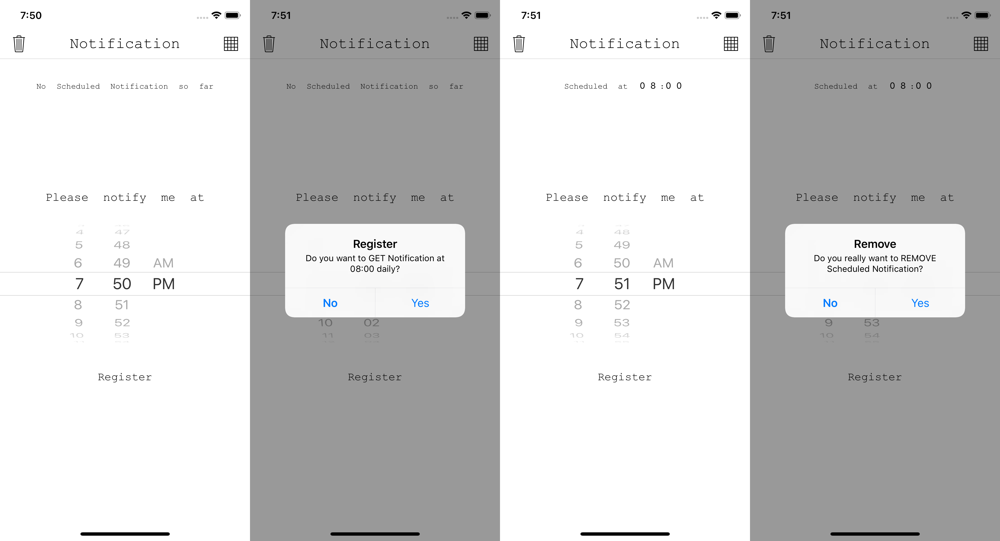

## GitBingo (깃빙고)

**1일 1커밋을 실천하려는 개발자들을 위한 어플리케이션**

#### 기능

1. 실시간 Contribution 확인 가능
2. 원하는 시간에 알람을 받아 금일 커밋을 진행하였는지 확인 가능

#### 사용한 기술

- `Swift4`, `Xcode9`, `UserNotifications`, `Error Handling`

#### 사용한 아키텍쳐

- `Delegation `, `Singleton`
- 시도한 아키텍쳐 : `MVP`

#### 사용한 라이브러리

- [`Kanna`](https://github.com/tid-kijyun/Kanna) - https://github.com/users/ehdrjsdlzzzz/contributions로부터 HTML을 파싱해오기 위해 사용
- [`Alamofire`](https://github.com/Alamofire/Alamofire) - 통신을 위해 사용
- [`SVProgressHUD`](https://github.com/SVProgressHUD/SVProgressHUD) - Indicator와 함께 코멘트를 사용하기 위해 사용

#### 스크린샷

**메인**

**알람 설정**

**알람 수신**

> 알람 수신을 스크린샷을 위해 위의 알람 설정 화면에서 설정한 시간과 차이가 존재합니다. 

