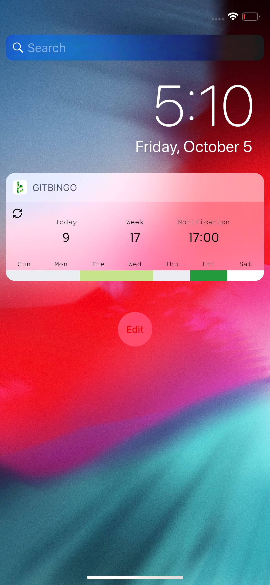

## [GitBingo (깃빙고)](https://itunes.apple.com/kr/app/gitbingo/id1435428800?l=en&mt=8)

> App Icon by [snowJang24](https://github.com/snowjang24), App Name by [nailerHeum](https://github.com/nailerHeum)

**1일 1커밋을 실천하려는 개발자들을 위한 어플리케이션**

#### 기능

1. 실시간 Contribution 확인 가능
2. 원하는 시간에 알람을 받아 금일 커밋을 진행하였는지 확인 가능
3. 투데이 익스텐션 타겟을 사용해 위젯에서 이번주 커밋 정보와 알람 등록 시간을 확인 가능

#### 사용한 기술

- `Swift4`, `Xcode9`, `UserNotifications`, `Error Handling`, `Localizing`, `Networking`, `UIApplicationShortCuts`, `Today Extensions`

#### 사용한 아키텍쳐

- `Delegation `, `Singleton`
- 시도한 아키텍쳐 : `MVP`

#### 공부한 내용 정리

- App Extension Programming Guide for iOS
  - [Essential](https://ehdrjsdlzzzz.github.io/2018/10/03/App-Extension-Programming-Guide-1/)
  - [Essential - Handling Common Scenarios](https://ehdrjsdlzzzz.github.io/2018/10/09/App-Extension-Programming-Guide-2/)

#### 사용한 라이브러리

- [`Kanna`](https://github.com/tid-kijyun/Kanna) - https://github.com/users/ehdrjsdlzzzz/contributions 로부터 HTML을 파싱해오기 위해 사용
- [`SVProgressHUD`](https://github.com/SVProgressHUD/SVProgressHUD) - Indicator와 함께 코멘트를 사용하기 위해 사용

#### 문제점

- 웹 브라우저에선 00:00 이후 다음 날 컨트리뷰션 도트를 바로 확인 가능하지만 앱에선 GMT 시간 차로 오전 9시가 되어서야 그날의 도트를 받아올 수 있음.
  - 이 문제를 해결하기 위해 많은 노력을 해보았으나 해결 
  - 확인해본 결과 모바일 크롬이나 사파리에서도 동일한 이슈가 발생한 것으로 모바일에서 요청한 것에 대한 깃헙 서버의 응답에 이슈가 있는 것으로 판단하였음.

#### 스크린샷

**메인**

**알람 설정**

**알람 수신**

> 알람 수신을 스크린샷을 위해 위의 알람 설정 화면에서 설정한 시간과 차이가 존재합니다. 

**Version 2.0 - Widget** 

